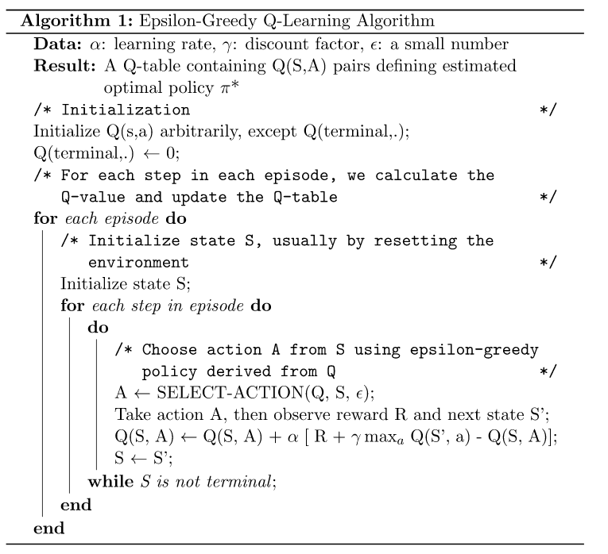
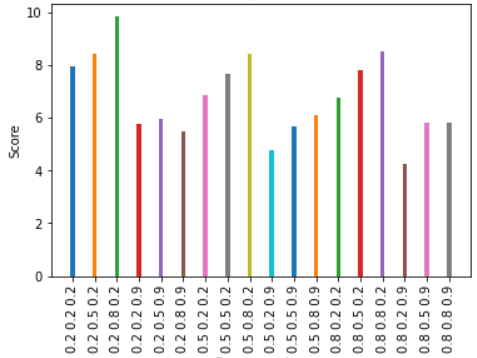
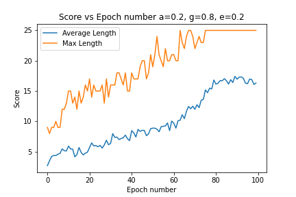
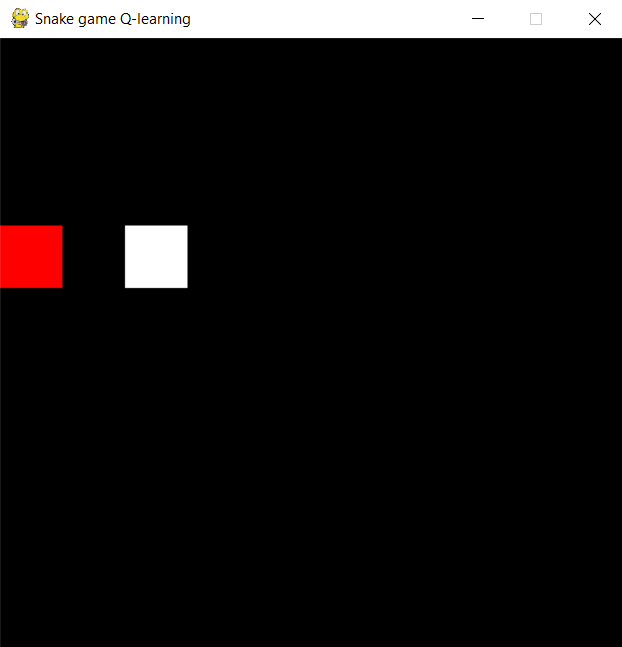
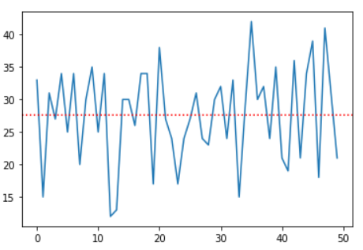

# Snake Game using Q-Learning
> submitted as a academic coursework project

## Introduction
Snake game is a computer game, in which the player controls a snake to move around and collect food in a grid. In this project an AI-based agent is developed using reinforcement learning approach namely Q-learning. 
In the game, the snake is allowed to pass through all the area around a 2-Dimensional environment or grid which is surrounded by walls. At each distinct interval (a time step), the snake should move forward, turn left, turn right, as the snake requires and the snake cannot stop moving. The game will be generating random piece of food that will be placed anywhere in the environment. When the snake moves towards the food and if the food is eaten then the length of the snake will be increased by one. The goal of the game is to eat as many foods without getting collide to the wall or by itself. The objective of the game is to maximize the score or length of snake. To achieve this an AI-based agent is to be developed in order to maximize our score.

## Objectives
- To study the snake game and code a working replica of the game.
- Making an AI agent using Q-learning
- Tuning hyperparameters to optimize the performance.

## Libraries Used
-pygame
-matplotlib

## Implementation
###Creating Environment and Agent:
The Snake game environment, shown in figure is the game implemented using custom code that closely matches snake game. This allows for full control over the size of the board and rules of play. The reward function was chosen to be 1 million if the snake completes the game. The game ends when the snake collides with its own body or the walls. Further a time penalty was introduced to avoid loops. In order to facilitate fast evaluation, and to increase the probability of the snake finding food a small game board of 5x5 were used, and required no pre-processing.

### Rewards
Rewards are the enforcement provided to the agent to train it. That is, if the snake grabs a food, give it a reward, if the snake dies, the reward is negative. The agent will try to maximize the reward and will take action accordingly. 
- Snake eats an apple			length(snake)^2
- Snake does nothing			-time interval
- Snake dies (hit the body or wall)	-1000
- Snake completes the game		1Million

### Actions
Actions are performed by the agent in the environment as in our case it can choose between going forward (1), right (2), or left (0). To maximize the reward, the agent will try to take optimal action based on the algorithm.

### Defining Q states
In our game 2049 number of states are possible which are defined by the percept/vision of the snake as:
- Vision 1: presence of a wall/tail in the immediate surroundings (left forward right). For each direction it may have a possible 2^3 = 8 number of combinations.
- Vision 2: presence of a tail in 3 directions (left forward right). For each direction it may have a possible 2^3 = 8 number of combinations.
- Vision 3: relative apple location in 8 quadrants. For each direction it may have a possible 8 number of combinations.
- Vision 4: last turn (left right). For each turn it may have a possible 2 combinations.
- Vision 5: length of the snake (short long). Here it may have a possible 2 combinations, defined by if the snake size is more than one-third of grid size or not.
Hence the possible number of states of our game will be 8 * 8 * 8 * 2 * 2 + 1 = 2049 states.

### Q-Algorithm:
In Q-learning we use Q-Table is just a fancy name for a simple lookup table where we calculate the maximum expected future rewards for action at each state. Basically, this table will guide us to the best action at each state. In the Q-Table, the columns are the actions and the rows are the states.
To learn each value of the Q-table, we make use of the Q-Learning algorithm.

## Tuning Hyperparameters
The parameters alpha, gamma, and epsilon were selected by performing the training on a set of learning rate, discount factor, epsilon decay parameters, over specific intervals, for a grid size of 5*5 

## Output

